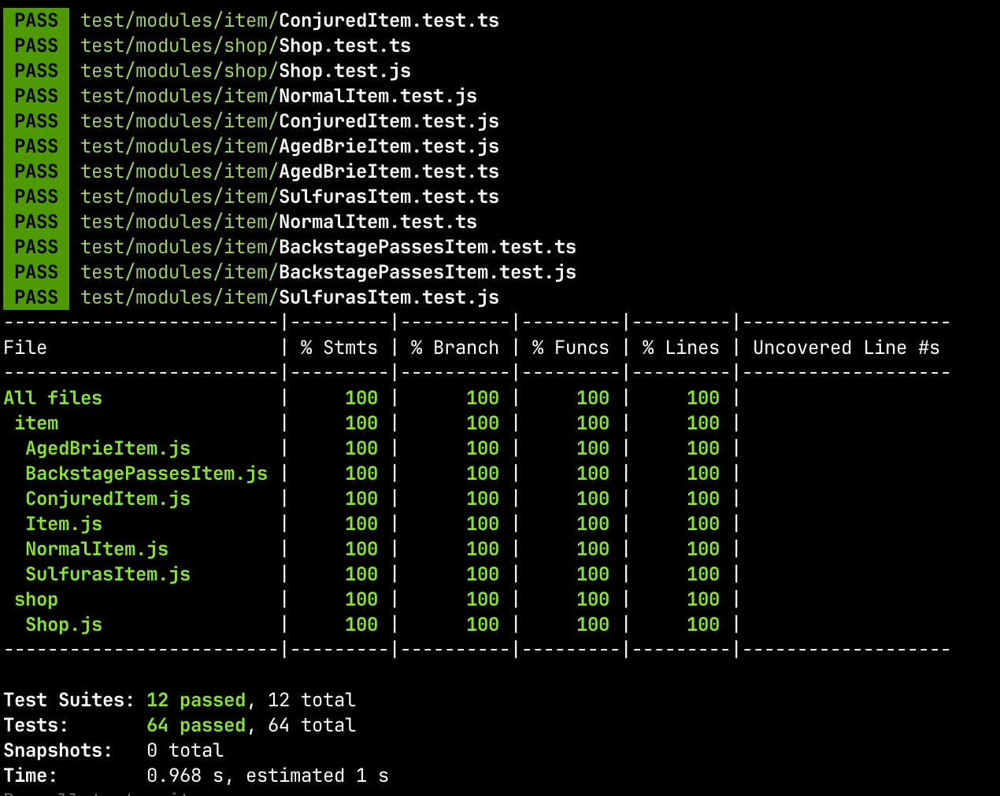

# Gilded Rose

This is the Gilded Rose kata in JavaScript with Jest

## Getting started

Install dependencies

```sh
npm install
```

# Project Commands

This document outlines the commands used for various tasks in the project.

## Testing

- **Run Tests:** Run TypeScript compiler, ESLint, Prettier, and Jest tests.
    ```sh
    npm run test
    ```

- **Watch Tests:** Run TypeScript compiler and Jest tests in watch mode.
    ```sh
    npm run test:watch
    ```

- **Test Coverage:** Run TypeScript compiler and generate a test coverage report.
    ```sh
    npm run test:coverage
    ```

## Linting

- **Lint Code:** Run ESLint using the Babel parser for linting.
    ```sh
    npm run lint
    ```

- **Lint and Fix:** Run ESLint using the Babel parser and automatically fix issues.
    ```sh
    npm run lint:fix
    ```

## Formatting

- **Format Code:** Use Prettier to automatically format TypeScript files.
    ```sh
    npm run format
    ```

## Running Jest in Docker Container

- **Build Docker Image:** Build the Docker image for running tests.
    ```sh
    docker build -t gilded-rose .
    ```
- **Run Tests:** Run the tests in the Docker container and remove the only this container when finished.
    ```sh
    docker run -t -a=STDOUT gilded-rose npm run test:coverage && docker ps -a | grep "Exited" | awk '{print $1}' | xargs docker rm
    ```


## Code Coverage: 100%


